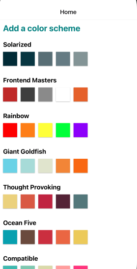

# React-Native Tutorial
Duration: 1 week (1-3 hours per day)  

Description: A simple color palette app with the ability to add new palettes from a library of select swatches. Tutorial completed through [Front End Masters](https://frontendmasters.com/courses/react-native-v2/) by Kadi Kraman.

  

# Prerequisites
This project uses the following:
* [Node.js](https://nodejs.org/en/download/)
* [Expo](https://docs.expo.dev/)
* [Xcode](https://apps.apple.com/us/app/xcode/id497799835)

# Installation
1. Download or clone the source code.
2. Open the project in your favorite editor, 
3. Navigate to the project location in a terminal.
4. Enter `npm install` in the terminal.
5. Enter `expo start` in the terminal.
6. Type `i` for the iOS simulator.

# Usage
1. Select a palette option for the corresponding colors and hex codes.  
OR
1. Select the `Add New Palette` button.
2. Input a name for the new palette. A warning alert will display if a name is not entered.
3. Select colors for the new palette. A warning alert will display if a minimum of 3 have not been selected.
4. Submit the new palette.
5. (optional) Review the new palette (and corresponding hex codes) by clicking on it.

# Built With
* [React Native](https://reactnative.dev/)
* [Expo CLI](https://docs.expo.dev/workflow/expo-cli/)
* [Eslint](https://eslint.org/)
* [Prettier](https://prettier.io/)
* [Xcode](https://apps.apple.com/us/app/xcode/id497799835)

# Impediments & Improvements
Improvements:
* Given that this was a tutorial without a specific user story behind it (or one that I can immediately think of as a frame of reference), the project seems sufficient at present.

Impediments:
* (2/7/22) Diffuclities deploying and retaining full functionality on Heroku.

# Acknowledgement
Thanks to [Kadi Kraman](https://github.com/kadikraman).